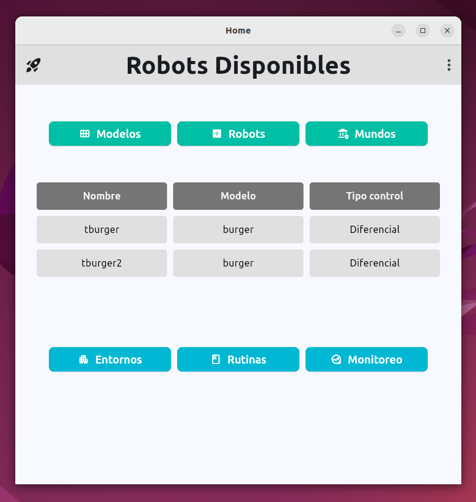
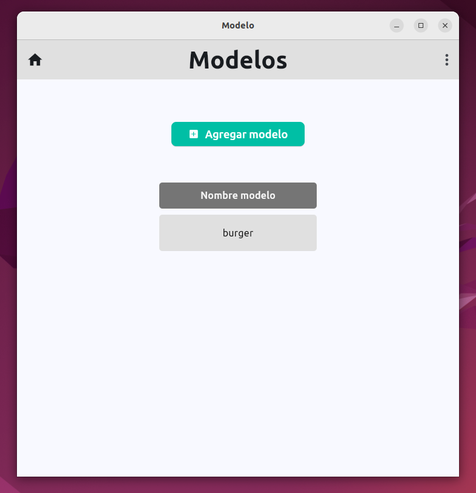
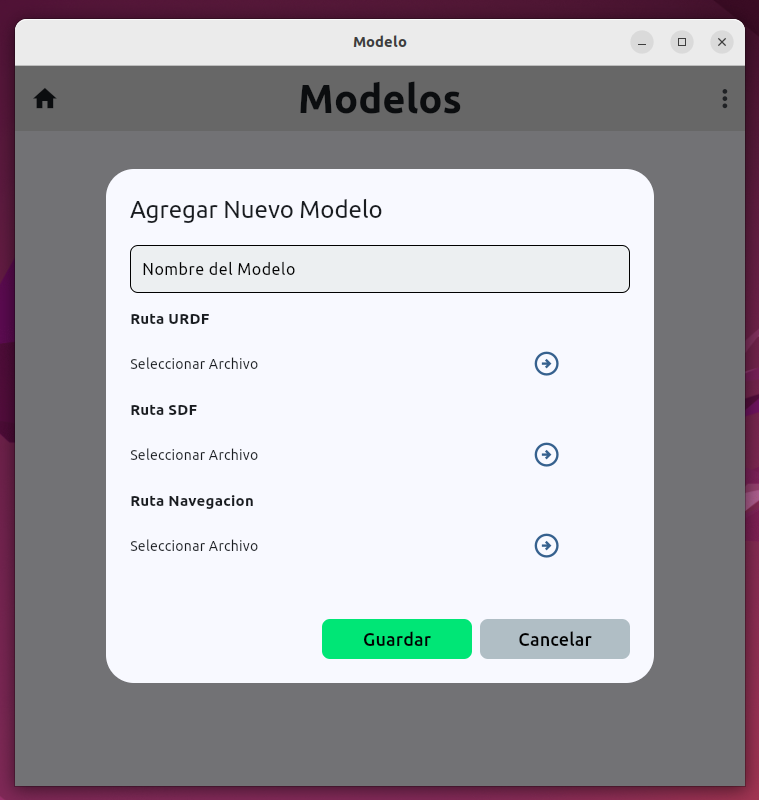
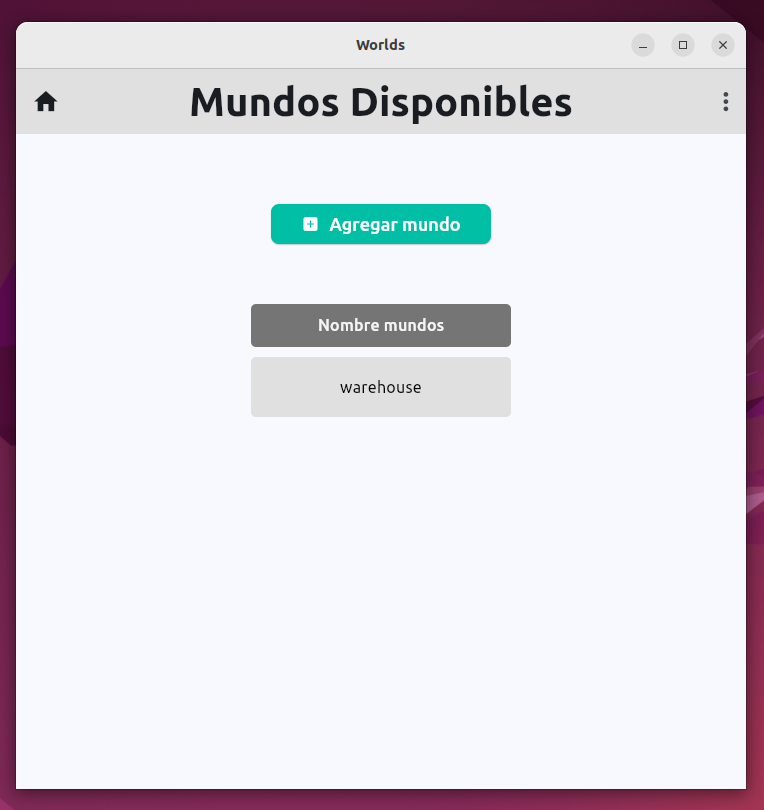
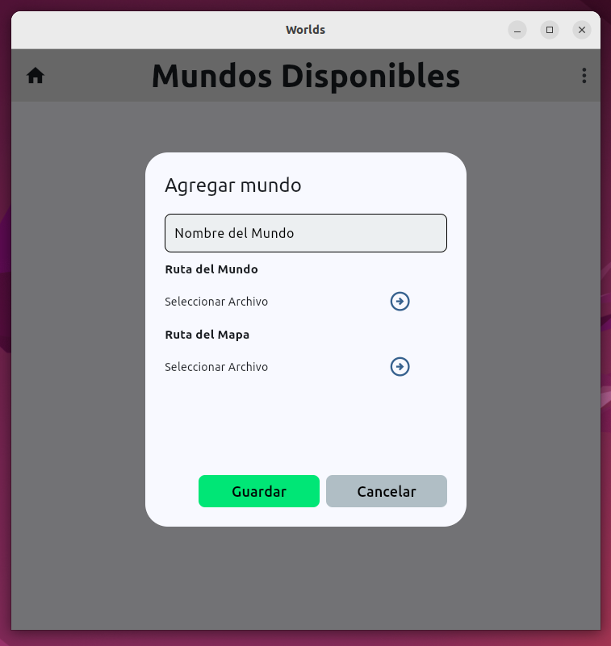
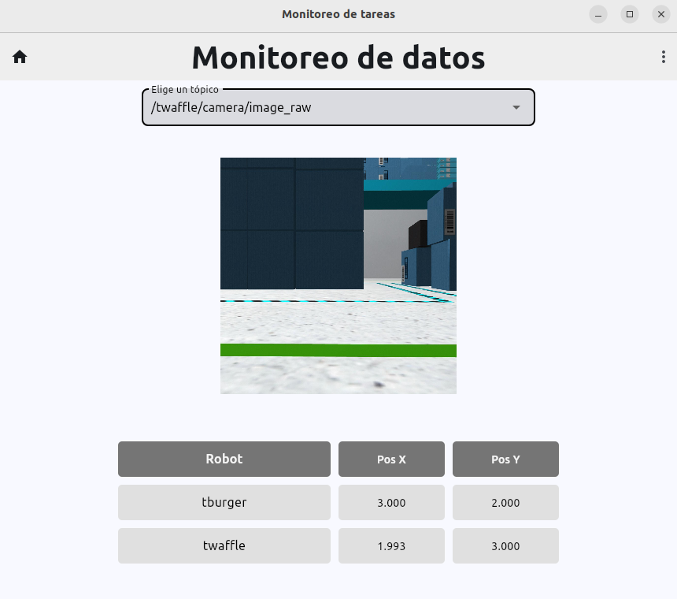

<h1 align="center">
  App Multi Robot  

  [RobotMap] 
</h1>

## Description
This application allows the user to enter the configuration parameters of the [master-slave architecture](https://github.com/iesusdavila/master_slave_mrs), through an interactive and easy-to-use interface without having knowledge of ROS2, you will be able to deploy the environment with multiple robots and assign them specialized tasks according to the designated robot.

## Features

- Robot management, by manufacturing model.
- Allows including worlds (receiving a WORLD file and a map)
- Environment configuration (world and robots in their initial positions).
- Task configuration from each of the environments.
- Real-time monitoring of position and camera topics, for each of the robots.
- Cloud Sync (in development)


## Installation
Como requerimiento inicial necesitaremos el modulo de flet:

```bash
  pip install flet
```

Ademas de instalar dependencias necesarias, como: 

```bash
  sudo apt install libmpv1
  sudo apt install zenity
```

Iniciando el codigo para pruebas: 
```bash
  python3 main.py
```

## Deployment

### Home view

<p align="center">
   
</p>

### Add models

<p align="center">
   
</p>

<p align="center">
   
</p>

### Add robots

<p align="center">
   
</p>

### Add world

<p align="center">
   
</p>

<p align="center">
   
</p>

# Real-time monitoring

<p align="center">
   
</p>

## Authors

- [@iesusdavila](https://github.com/iesusdavila)
- [@cesarq19](https://github.com/Cesarq19)
